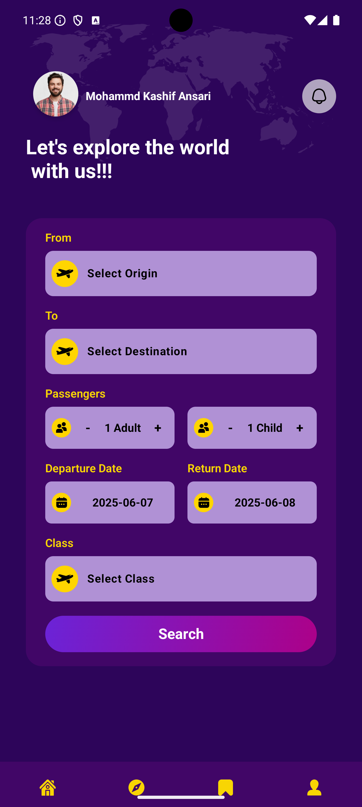
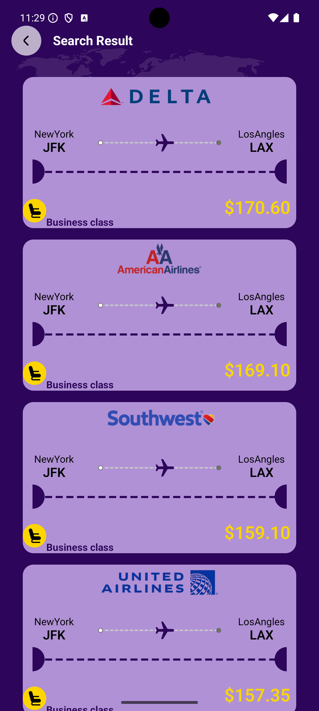
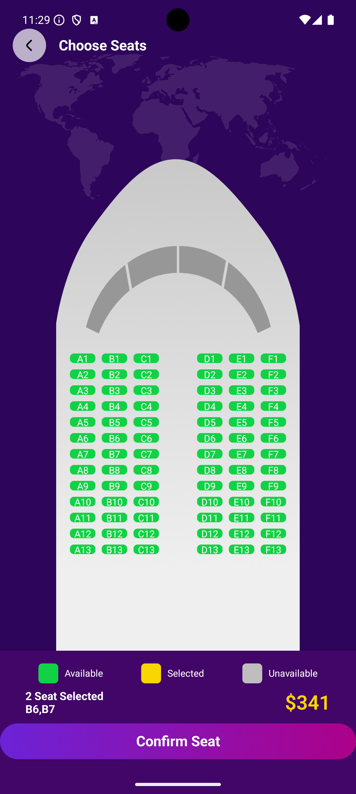
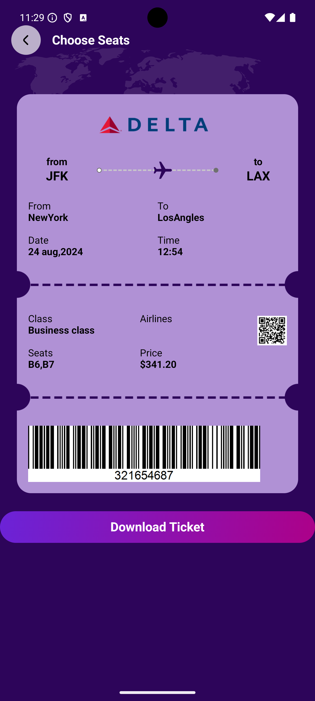

# ✈️ Travel Booking App

A modern travel booking app built with Jetpack Compose and Kotlin, following MVVM architecture. The app guides users through a seamless ticket booking flow—from selecting departure and arrival cities, travel class, and seats, to viewing detailed ticket information. It integrates Firebase Realtime Database for storing and retrieving travel data in real time.

## 📸 Screenshots







## 🔑 Key Features

- **Modern UI with Jetpack Compose**: Sleek and responsive design with a smooth user experience.
- **Clean Architecture**: Ensures a scalable and maintainable codebase following MVVM principles.
- **Firebase Realtime Database**: Provides real-time data storage and syncing.
- **Multi-step Booking Flow**: 
-- Select From and To destinations

-- Choose Travel Class (e.g., Economy, Business)

-- Pick your Travel Date

-- Select available Seats

-- View and confirm Ticket Details
- **Kotlin Coroutines & Flow**: For efficient background processing and reactive data handling.


## 🧰 Technologies Used

- **Jetpack Compose**: For building the UI.
- **MVVM Architecture**: For a clean and maintainable codebase.
- **Firebase Realtime Database**: Backend for real-time syncing.


## ⚙️ Installation

1. Clone the repository:
    ```bash
    git clone https://github.com/kashifansari786/travel-booking-app.git
    ```

2. Open the project in Android Studio.

3. Connect Firebase:

- Create a Firebase project at Firebase Console

- Enable Realtime Database

- Download the google-services.json file and place it inside the app/ directory

4. Build the project:
    ```bash
    ./gradlew build
    ```

5. Run the app on an emulator or physical device.

## 💡 Usage

- Select departure and arrival cities(only From-New York, To- Loas Angles).
- Pick your preferred travel class and date.
- Choose available seats.
- Review and confirm ticket details.

## 🤝 Contributing

Contributions are welcome! Please fork the repository and submit a pull request for any enhancements or bug fixes.

## 📄 License

This project is licensed under the MIT License - see the [LICENSE](LICENSE) file for details.

## 🙏 Acknowledgements

- [Jetpack Compose](https://developer.android.com/jetpack/compose)
- [Room Database](https://developer.android.com/training/data-storage/room)
- [DataStore Preferences](https://developer.android.com/topic/libraries/architecture/datastore)
- [Dagger Hilt](https://dagger.dev/hilt/)
- [Retrofit](https://square.github.io/retrofit/)
- [Paging 3](https://developer.android.com/topic/libraries/architecture/paging/v3)
